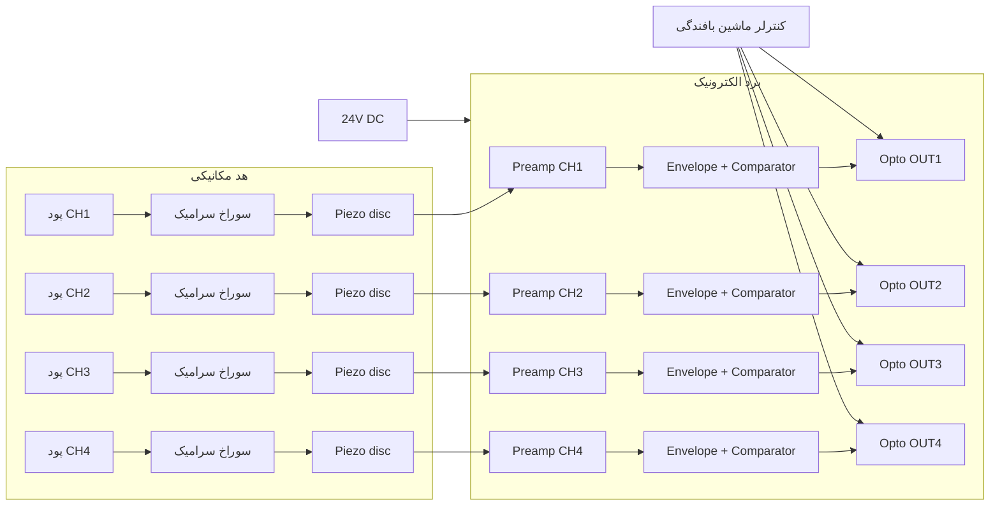

# نمای کلی سیستم

## بلوک دیاگرام

## معماری پیشنهادی

طراحی بر پایه **۴ کانال آنالوگ مستقل** است (بدون `MCU` در نسخه پایه):

| بلوک | نقش |
|------|-----|
| سوراخ سرامیک | هدایت پود با اصطکاک کنترل‌شده |
| پین انتقال + فنر | انتقال ارتعاش به `piezo` |
| دیسک پیزو | تبدیل ارتعاش به ولتاژ `AC` |
| `Charge/voltage preamp` | تقویت با ورودی امپدانس بالا |
| `Band-pass` | حذف نویز و `DC` |
| `Envelope detector` | استخراج دامنه لحظه‌ای |
| `Comparator` | تصمیم «پود هست / پارگی» |
| اپتوکوپلر | جداسازی گالوانیک از کنترلر ماشین |

## منطق خروجی (مطابق رویه صنعتی)

| وضعیت | خروجی اپتوکوپلر | معنی |
|--------|-----------------|------|
| تغذیه روشن + پود در حرکت | **باز** (`OFF`) | نرمال — ماشین کار می‌کند |
| تغذیه روشن + بدون حرکت پود | **بسته** (`ON`) | پارگی — سیگنال توقف |
| تغذیه خاموش | باز | حالت ایمن |

> منطق دقیق را می‌توان در `PCB` با اینورتر خروجی معکوس کرد تا با `PLC` موجود ماشین سازگار شود.

## تفاوت با سنسور نوری/خازنی

| روش | مزیت | محدودیت |
|-----|------|---------|
| **پیزو (این طراحی)** | مقاوم در برابر گرد و غبار، رطوبت، تغییر رنگ پود | نیاز به تماس مکانیکی کنترل‌شده |
| نوری | بدون تماس | آلودگی نوری، حساس به رنگ |
| خازنی | حساس به جرم پود | کالیبراسیون سخت‌تر، حساس به رطوبت |

## نسخه‌های قابل توسعه

| نسخه | توضیح |
|------|--------|
| **Rev A** (این سند) | ۴ کانال آنالوگ، خروجی اپتو، پتانسیومتر حساسیت |
| **Rev B** | افزودن `STM32F030` + خروجی `UART`/`CAN` برای مانیتورینگ |
| **Rev C** | خروجی جریان `4–20 mA` متناسب با دامنه سیگنال (`ANTI` function) |

## الزامات محیطی ماشین بافندگی

- ارتعاش پایه ماشین: فیلتر `band-pass` فرکانس قطع پایین `≈ 80 Hz`
- نویز برق `24V`: `LC filter` + `TVS` + جداسازی زمین آنالوگ/دیجیتال
- `EMI` موتورها: شیلد فویل در `PCB`، کانکتورهای پوشیده
